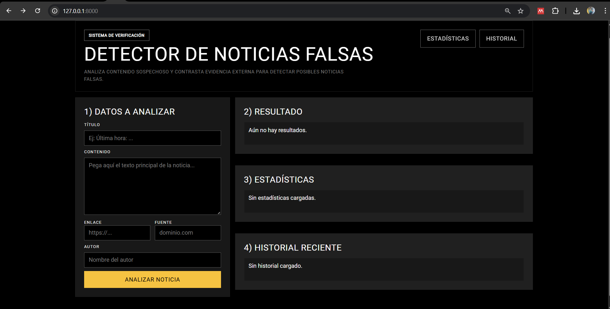
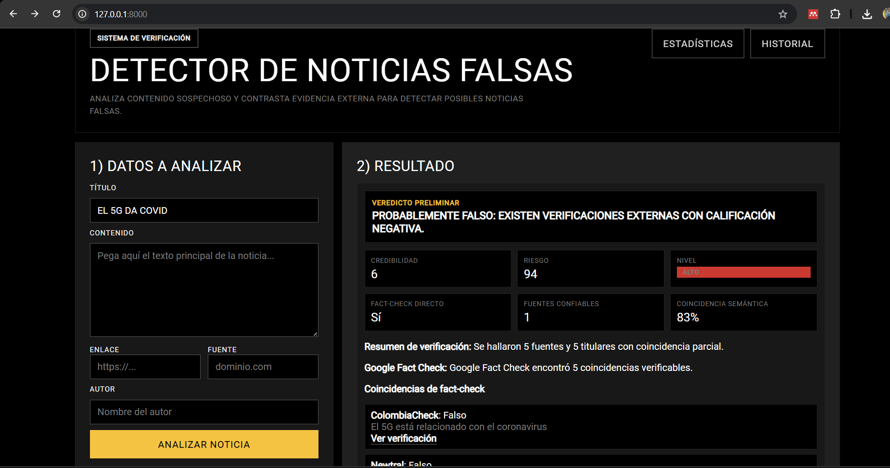
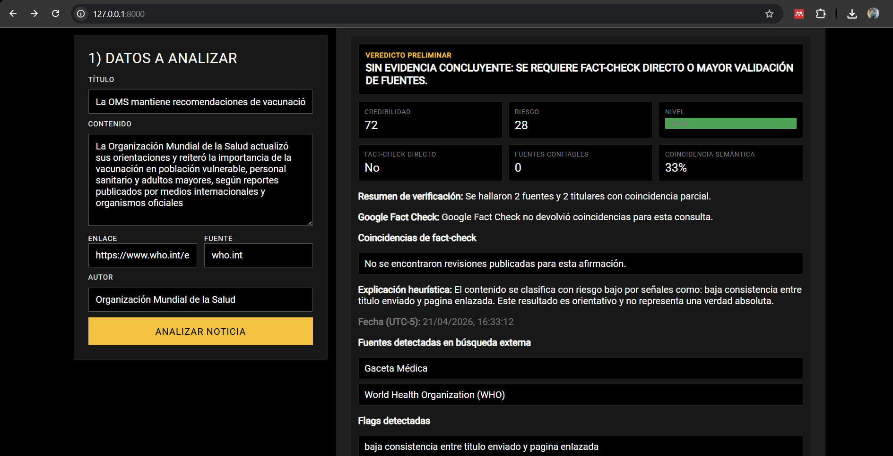

# Detector de noticias falsas

## Trabajo Académico — Grupo 3
**Integrantes:** Erik Flores • Cristian González • Klever Barahona

---

API REST desarrollada con FastAPI para analizar contenido noticioso, contrastar evidencia externa y estimar el riesgo de desinformación con un resultado explicable para el usuario.

## Resumen del proyecto

Este proyecto combina tres capas:

1. **Procesamiento de datos de entrada** (título, contenido, enlace, fuente, autor).
2. **Contraste con fuentes externas** (Google Fact Check + resultados de noticias en línea).
3. **Motor heurístico configurable** para calcular `risk_score`, `credibility_score` y veredicto.

Además, incluye una interfaz web en HTML/CSS/JS para demostrar el análisis de forma visual y usable.

<strong>Cómo está construido</strong>

- Backend en `FastAPI` con estructura modular (`routers`, `services`, `schemas`, `models`).
- Persistencia en `SQLite` mediante `SQLAlchemy`.
- Integración con API externa:
  - Google Fact Check Tools API para obtener verificaciones publicadas.
- Servicio de análisis en `app/services/analyzer.py`:
  - normaliza entrada,
  - compara evidencia externa,
  - aplica reglas de scoring,
  - devuelve veredicto y explicación.
- Interfaz en `app/templates/index.html` + `app/static/styles.css`:
  - formulario de análisis,
  - visualización de veredicto, métricas, fuentes y fact-checks.

<strong>Contenido del repositorio</strong>

- Código fuente del API.
- Configuración del modelo heurístico (`config/rules.yaml`).
- `README.md` documentado.

## Ejecución local

<strong>Pasos</strong>

1. Crear entorno virtual:
   - `python -m venv .venv`
2. Activar entorno (PowerShell):
   - `.\.venv\Scripts\Activate.ps1`
3. Instalar dependencias:
   - `pip install -r requirements.txt`
4. Configurar API key externa:
   - `$env:FACT_CHECK_API_KEY="tu_api_key_aqui"`
5. Iniciar el servidor:
   - `uvicorn app.main:app --reload`

Accesos locales:

- Interfaz web: [http://127.0.0.1:8000](http://127.0.0.1:8000)
- Documentación Swagger: [http://127.0.0.1:8000/docs](http://127.0.0.1:8000/docs)

<strong>Endpoints principales</strong>

- `GET /health`
- `POST /analyze`
- `GET /history`
- `GET /stats`
- `GET /`

## Evidencia de funcionamiento local

<strong>Capturas</strong>

1. **Interfaz principal cargada localmente**
   
   

2. **Caso de noticia falsa detectada**
   
   

3. **Caso de noticia real o con alta corroboración**
   
   

4. **Swagger /docs funcionando**
   
   

